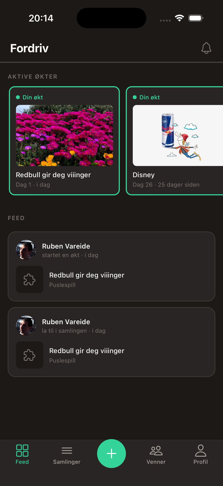
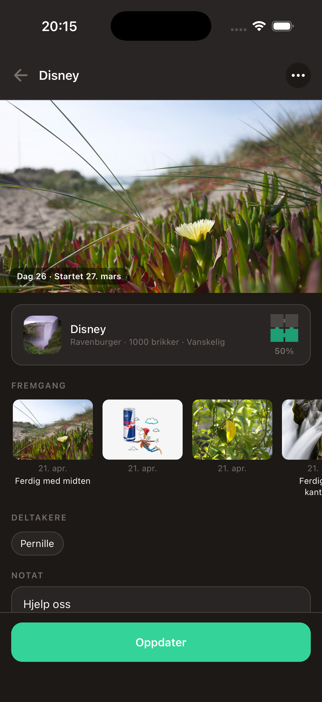
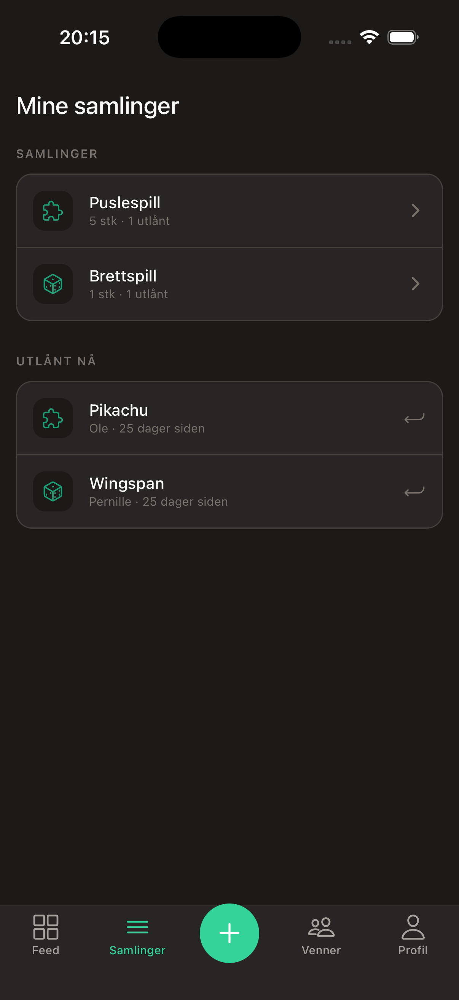

# 🧩 Puslespill-appen

Sosial mobilapp for vennegjenger som pusler sammen. Del samlinger, hold styr på utlån, og følg hverandres puslespilløkter.

> **Status:** Kjernefunksjonalitet på plass: samlinger, utlån, fremgangssporing, feed og Google-autentisering via Supabase. Venne-seksjonen er foreløpig mock data, reell kobling mellom brukere er neste steg. Jobber mot offentlig beta.

<p align="center">
  
  
  
</p>

## Om prosjektet

Et personlig prosjekt bygget rundt en reell use case: vennegjengen min låner puslespill av hverandre og mister oversikt. Appen løser tre ting: delte samlinger synlig for hele gjengen, utlånslogg så ingen glemmer hvem som har hva, og en økt-feed som gjør pusling til en sosial aktivitet snarere enn en isolert hobby.

Prosjektet brukes også som utforsking av React Native-stacken mot Expo SDK 55 med development builds, NativeWind for styling, og Supabase som backend inkludert auth, database og bildeopplasting.

## Stack

React Native med Expo (SDK 55), TypeScript i strict mode, NativeWind for Tailwind-styling, React Navigation med bottom tabs pluss modal, og Supabase som backend for auth, Postgres og storage. Expo Vector Icons for ikonografi. Development builds via EAS i stedet for Expo Go.

## Arkitektur

Tab-basert navigasjon med fem ankerpunkter: Feed, Samlinger, en sentral `+`-knapp, Venner og Profil. `+`-knappen åpner en modal med kontekstavhengige handlinger (legg til i samling, start ny økt, registrer utlån) heller enn å navigere til en egen fane. Valget reduserer dybden i navigasjonstreet for hyppige handlinger.

```
src/
├── navigation/     App-navigasjon og +-modal
├── screens/        Én fil per skjerm
├── components/     Gjenbrukbare UI-komponenter
├── context/        React Context (profil m.m.)
├── utils/          Delte hjelpefunksjoner
└── lib/            Supabase-klient
```

Full prosjektdokumentasjon, konsept, wireframes og fremdrift ligger i [puslespill-app.md](./puslespill-app.md). Kjent teknisk gjeld er dokumentert i [tech-debt.md](./tech-debt.md).

## Lokal utvikling

Prosjektet kjører på Expo SDK 55 og bruker development builds i stedet for Expo Go. Førstegangsoppsett:

```bash
npm install
```

Deretter trenger du enten en development build installert på mobilen, eller Expo Go i simulator:

```bash
# Med development build installert
npx expo start --dev-client

# Eller med Expo Go i iOS-simulator
npx expo start --go
```

### Bygge development build

```bash
eas login
eas build --profile development --platform android
```

EAS gir deg en lenke og QR-kode til APK-en når bygget er ferdig. Scan fra mobilen, installer, ferdig. Se `eas.json` for profiler.

## Om utvikleren

Frontend- og mobilutvikler med bachelor fra Høyskolen Kristiania (2026) og bakgrunn som autorisert optiker. Prosjektet er en del av porteføljen min. Mer på [rubenvareide.no](https://rubenvareide.no) og [LinkedIn](https://www.linkedin.com/in/rubenvareide/).
