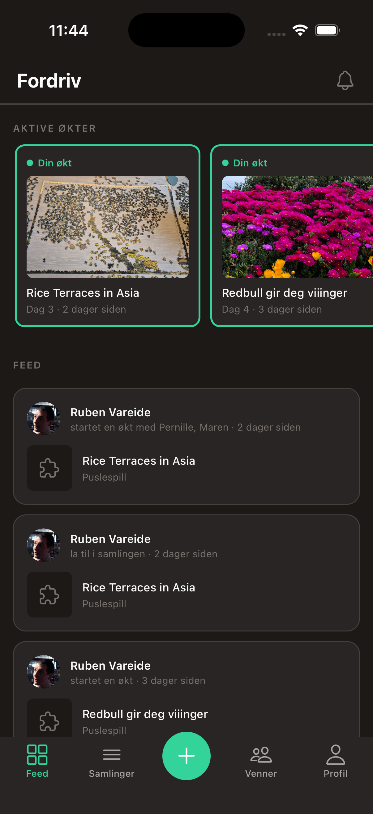
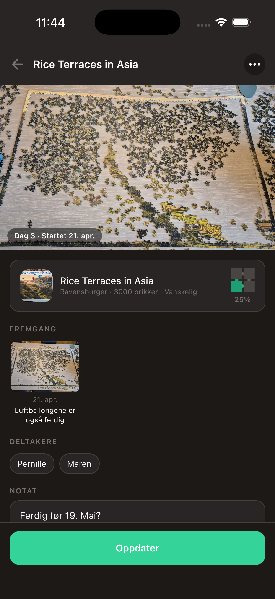
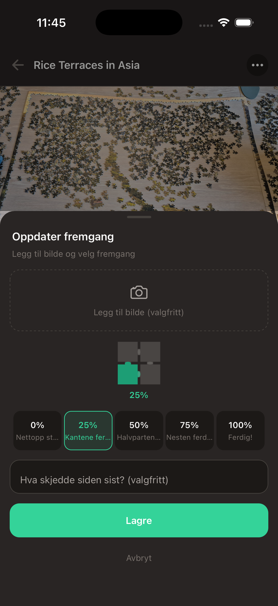
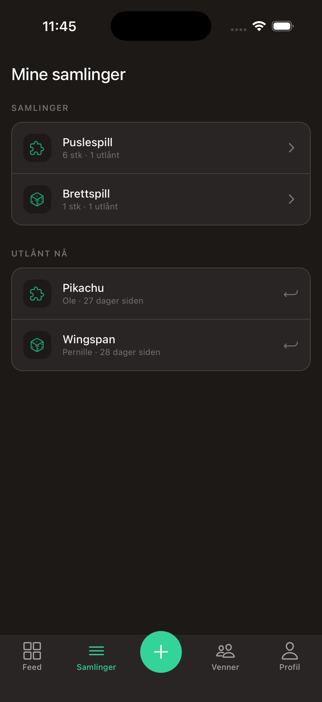

# 🧩 Puslespill-appen

Sosial mobilapp for vennegjenger som pusler sammen. Del samlinger, hold styr på utlån, og følg hverandres puslespilløkter.

> **Status:** Kjernefunksjonalitet på plass: samlinger, utlån, fremgangssporing, feed, venner (invitasjonskoder + venners samlinger) og Google-autentisering via Supabase. Alle skjermer bruker nå ekte data. Neste steg: låneforespørsler mellom venner. Jobber mot offentlig beta.

<p align="center">
  
  
  
  
</p>

## Om prosjektet

Et personlig prosjekt bygget rundt en reell use case: vennegjengen min låner puslespill av hverandre og mister oversikt. Appen løser tre ting: delte samlinger synlig for hele gjengen, utlånslogg så ingen glemmer hvem som har hva, og en økt-feed som gjør pusling til en sosial aktivitet snarere enn en isolert hobby.

Prosjektet brukes også som utforsking av React Native-stacken mot Expo SDK 55 med development builds, NativeWind for styling, og Supabase som backend inkludert auth, database og bildeopplasting.

## Stack

React Native med Expo (SDK 55), TypeScript i strict mode, NativeWind for Tailwind-styling, React Navigation med bottom tabs pluss modal, og Supabase som backend for auth, Postgres og storage. Expo Vector Icons for ikonografi. Development builds via EAS i stedet for Expo Go.

## Arkitektur

Tab-basert navigasjon med fem ankerpunkter: Feed, Samlinger, en sentral `+`-knapp, Venner og Profil. `+`-knappen åpner en modal med kontekstavhengige handlinger (legg til i samling, start ny økt) heller enn å navigere til en egen fane. Valget reduserer dybden i navigasjonstreet for hyppige handlinger. Utlån registreres på gjenstandsnivå der konteksten er naturlig.

```
src/
├── navigation/     App-navigasjon og +-modal
├── screens/        Én fil per skjerm
├── components/     Gjenbrukbare UI-komponenter
├── context/        React Context (profil m.m.)
├── utils/          Delte hjelpefunksjoner
└── lib/            Supabase-klient
```

Full prosjektdokumentasjon, konsept, wireframes og fremdrift ligger i [puslespill-app.md](./puslespill-app.md). Veikart mot 1.0 ligger i [docs/PROJECT-PLAN.md](./docs/PROJECT-PLAN.md), og kjent teknisk gjeld i [tech-debt.md](./tech-debt.md).

## Lokal utvikling

Prosjektet kjører på Expo SDK 55 og bruker development builds i stedet for Expo Go. Førstegangsoppsett:

```bash
npm install
```

Deretter starter du dev-serveren. Velg modus etter **hvilken klient** som kjører koden og **hvor testeren er**:

```bash
# Development build (den ekte appen — kreves når egne native-moduler/plugins er i bruk)
npx expo start --dev-client            # LAN: mobilen må være på SAMME Wi-Fi som maskinen
npx expo start --dev-client --tunnel   # hvilket som helst nett / mobildata (via Expos tunnel)

# Expo Go (raske UI-sjekker; fungerer fordi alle native-avhengigheter er i SDK 55 sitt Go-sett)
npx expo start --go                    # åpne Expo Go-appen
npx expo start --go --ios              # + start iOS-simulator

# Tillegg som kan stables på alt over
--clear                                # tøm Metro-cache (gjør dette etter en større merge)
```

| Modus | Klient | Når |
| --- | --- | --- |
| `--dev-client` | `puslespill`-APK-en (eget ikon) | Standard. OAuth-redirect bruker `puslespill://`-scheme og virker kun her. |
| `--dev-client --tunnel` | Samme APK | Tester er på et **annet nett** (venn på egen Wi-Fi/mobildata). |
| `--go` | Expo Go-appen | Rask UI-/logikk-sjekk uten å installere en build. |

**Koble til enheten:** åpne klient-appen → «Enter URL manually» → `exp://…`-URL-en (LAN `exp://<mac-ip>:8081`, eller tunnel-URL-en). Dev build = åpne **puslespill**; Expo Go = åpne **Expo Go**.

**Tunnel-URL** er stabil per prosjekt: `exp://3ngoqts-rubenough-8081.exp.direct`. Krever `@expo/ngrok` (allerede devDep).

**iOS-simulator:** `--ios` kan henge på en «install recommended Expo Go?»-prompt. Start Metro uten `--ios` og åpne manuelt: `xcrun simctl openurl booted "exp://127.0.0.1:8081"`.

### Trenger jeg en ny build etter en merge?

JS/TS-endringer streames live over Metro — ingen ny build. **Bygg på nytt kun når native-laget endres** (native-avhengighet/config-plugin lagt til, `app.json`-native-config, SDK/RN-bump). Sjekk med:

```bash
npm run rebuild:check                  # sier om endringen krever ny build (native) eller ikke
```

### Bygge development build

```bash
eas login
eas build --profile development --platform android
```

EAS gir deg en lenke og QR-kode til APK-en når bygget er ferdig. Scan fra mobilen, installer, ferdig. Se `eas.json` for profiler.

## Om utvikleren

Frontend- og mobilutvikler med bachelor fra Høyskolen Kristiania (2026) og bakgrunn som autorisert optiker. Prosjektet er en del av porteføljen min. Mer [LinkedIn](https://www.linkedin.com/in/rubenvareide/).
